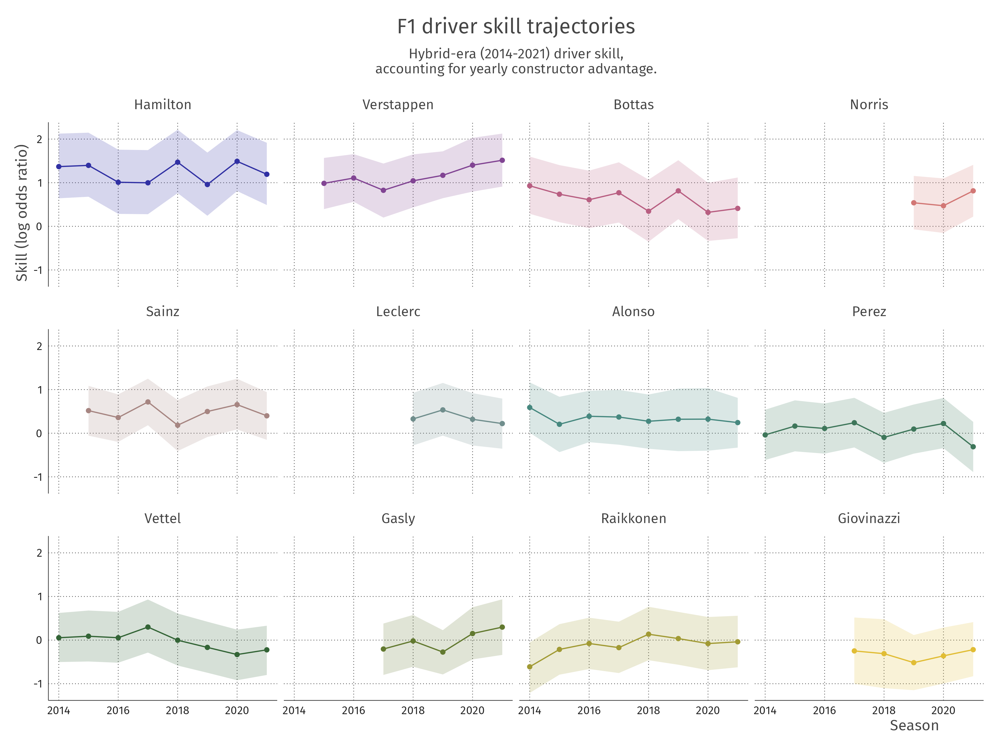

# Bayesian Analysis of Formula One Race Results

Repository containing code, data & presentation accompanying the manuscript _Bayesian Analysis of Formula One Race Results: Disentangling Driver Skill and Constructor Advantage_. The scripts contain the following:

| Script                                     | Contents                                                         |
| :----------------------------------------- | :--------------------------------------------------------------- |
| [`01_prep_data.R`](./01_prep_data.R)       | Data preparation, data joining from database `f1db_csv`          |
| [`02_process_data.R`](./02_process_data.R) | Data processing, status filtering, outcome computation, some EDA |
| [`03_model.R`](./03_model.R)               | Creating and estimating models                                   |
| [`04_compare.R`](./04_compare.R)           | Performing model comparison                                      |
| [`05_check.R`](./05_check.R)               | MCMC validation, posterior predictive checks                     |
| [`06_infer.R`](./06_infer.R)               | Inferences using posteriors of parameters                        |
| [`07_predict.R`](./07_predict.R)           | Counterfactual predictions                                       |

Data [`f1db_csv`](dat/f1db_csv) obtained from [Ergast developer API](http://ergast.com/mrd/db/) on 2022-02-17 uploaded with permission. All data objects (`.rds` and `.csv` files) are [CC BY 4.0](http://creativecommons.org/licenses/by/4.0/) licensed. Code is [MIT](LICENSE) licensed.

> Disclaimer: the ratings shown below are the result of a statistical model and its accompanying simplifying assumptions, estimated using only position data from 2014-2021. Please do not take the ratings as absolute truth.

NB: Presentation picture sources are in the notes.

