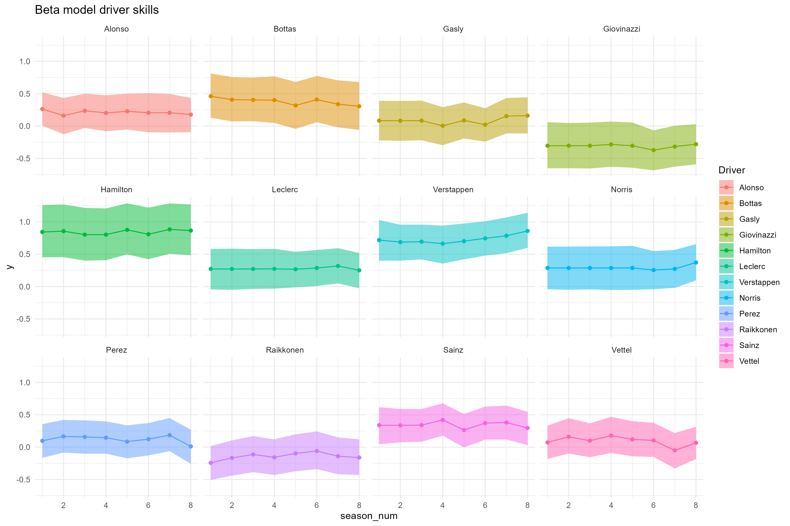
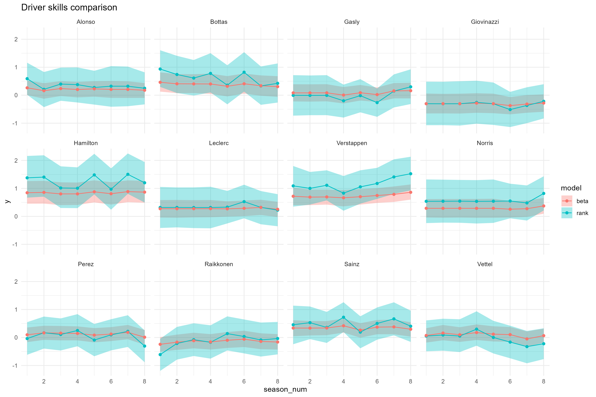
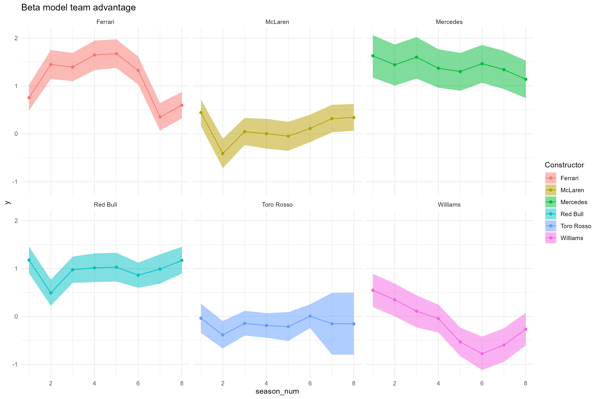
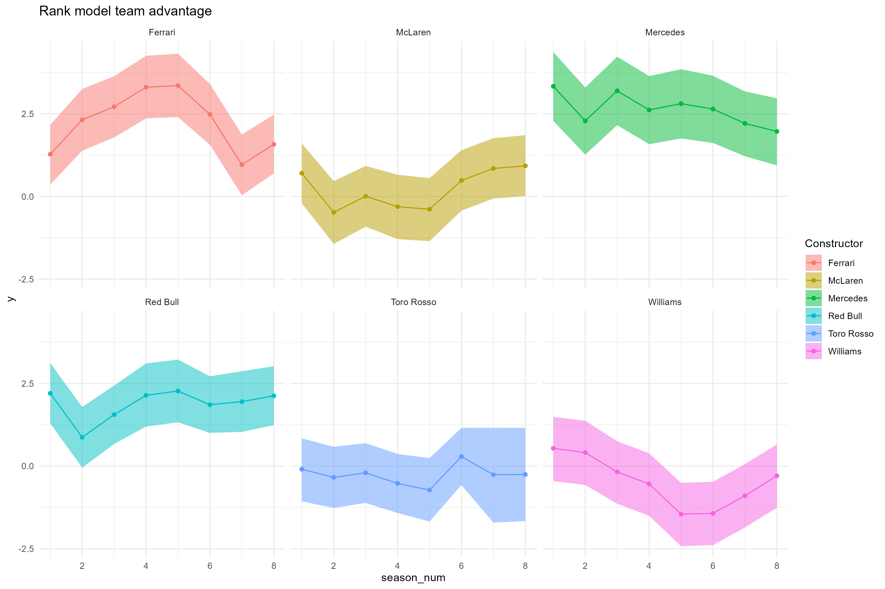
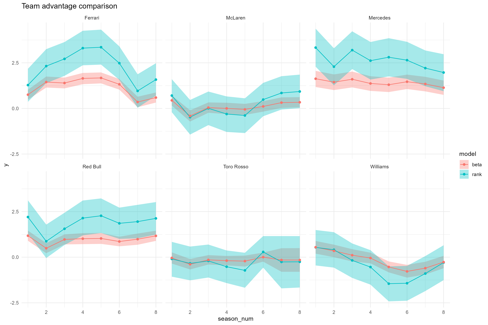

# Comparing beta model to rank-ordered logit model
In this folder, the beta model of the main paper was translated into a stan model ([here](./beta_model.stan)), and then compared to a rank-ordered logit model (as in [Glickman & Hennessy, 2015](http://www.glicko.net/research/multicompetitor.pdf)), with the same parameters and priors (stan code [here](./rank_model.stan)).

The result of this comparison, in general, is that the rank likelihood leads to more variance in the parameters due to its taking into account the correlation between finish positions. However, overall the patterns of parameter estimates are very similar, and thus the conclusions as well. In the sections below, several aspects of the model which are important for the paper are compared more specifically.

## Variance components
The rank model attributes relatively more variance in the outcome to the teams than to the individual drivers.

## Driver skills
The pattern of driver skills over time looks very similar between the two models, with more posterior variance in the rank likelihood model:

When we compare these two directly in a single plot, we can see that for the very good drivers (skill further away from 0), there is more discrepancy than for the mediocre drivers (skill near 0).

## Constructor advantage
For the teams, largely the same conclusion holds: similar patterns, with more posterior variance in the case of the teams. This is also shown in the relative smoothness of the parameters over time.

When comparing these directly, we can again see that extraordinary teams differ more than ordinary teams across these two models. The patterns are the same.

