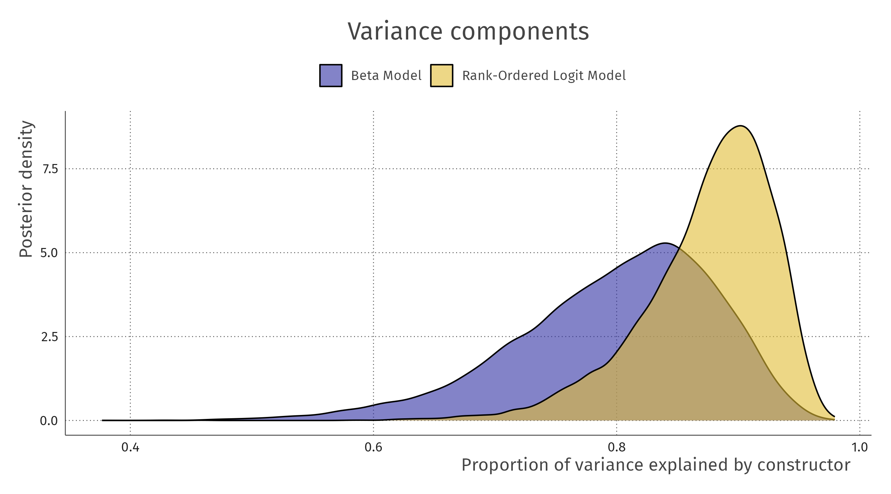
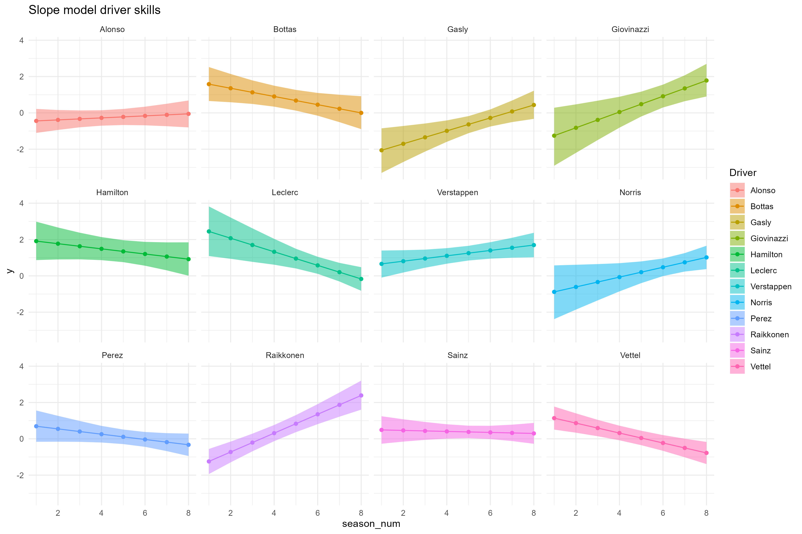

# Comparing beta model to rank-ordered logit model
In this folder, the beta model of the paper associated with version [`v1.0`](https://github.com/vankesteren/f1model/releases/tag/v1.0) was translated into a stan model ([here](./beta_model.stan)), and then compared to a rank-ordered logit model (as in [Glickman & Hennessy, 2015](http://www.glicko.net/research/multicompetitor.pdf)), with the same parameters and priors (stan code [here](./rank_model.stan)).

The result of this comparison, in general, is that the rank likelihood leads to more variance in the parameters due to its taking into account the correlation between finish positions. It also assigns more variance to the constructors relative to the drivers. However, overall the patterns of parameter estimates are very similar, and thus the conclusions as well. In the sections below, several aspects of the model which are important for the paper are compared more specifically.

## Variance components
The rank model attributes relatively more variance in the outcome to the teams than to the individual drivers.

## Driver skills
The pattern of driver skills over time looks very similar between the two models, with more posterior variance in the rank likelihood model. When we compare these two directly in a single plot, we can see that for the very good drivers (skill further away from 0), there is more discrepancy than for the mediocre drivers (skill near 0).

## Constructor advantage
For the teams, largely the same conclusion holds: similar patterns, with more posterior variance in the case of the teams. This is also shown in the relative smoothness of the parameters over time. When comparing these directly, we can again see that extraordinary teams differ more than ordinary teams across these two models. The patterns are the same.

# Comparing different dynamic skill parameter implementations
In writing the paper, we also made a modeling decision to not take time into account explicitly, but to estimate i.i.d. seasonal form parameters per driver and constructor. In this section, we briefly compare this to explicitly using a latent multilevel AR(1) implementation (`auto`), and to a more parsimonious multilevel intercept + slope model (`slope`) for the latent skill parameters.

Because these models have the same likelihood, we can compare them using efficient leave-one-out cross-validation:

| model | elpd_diff | se_diff |
| :---- | --------: | ------: |
| auto  |       0.0 |     0.0 |
| rank  |      -1.1 |     1.7 |
| slope |     -50.2 |    18.4 | 

The simple slope model is quite clearly worse than the other two implementations; it is not able to capture the skills properly. For example, looking at Giovinazzi in the plot below shows that he is estimated to be a top driver, which is unlikely given his results.

The AR(1) and default rank model are very similar in terms of LOOCV performance. Looking at the estimated skill trajectories, it becomes clear why this is the case:

The driver skills have extremely similar estimates. The same holds for the constructor advantage over time:

This made us decide to stay with the default rank model implementation.